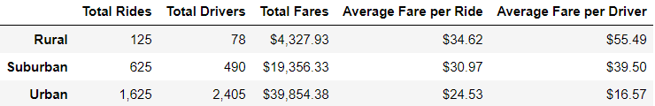

# PyBer_Analysis

## Overview of Pyber analysis:
The purpose of this project is to analyze the rideshare data from PyBer - a ride-sharing app company - and create a compelling visualization for the CEO. The result will help the company to improve access to ride-sharing services and determine affordability for underserved neighborhoods.

## Results:

### Resources
- Data Source: city_data.csv and ride_data.csv
- Software: Jupyter Notebook 6.1.4 running on Python 3.7.9

### A ride-sharing summary by city type
The summary below shows the total number of rides, total number of drivers, the total fares, the average fare per ride and average fare per driver for each city type (Rural, Suburban and Urban).

The number of rides in rural cities is 5 times lower than the number of rides in the suburban cities and 13 times lower than the number of rides in the urban cities.

The number of drivers in rural cities is about 6.5 and 31 times lower than the number of drivers in the suburban and urban cities, respectively. 

If we compare the average fare per ride between each city type, we'll notice that the average fare for rides in the rural cities is about $4 and $10 more per ride than the suburban and urban cities, respectively. Also, the average fare per driver in the rural cities is about $16 and $39 more than in the suburban and urban cities, respectively. 

### Total weekly fares for each city type chart

The chart below shows the total fares for each week by city type (Rural, Suburban and Urban) between January and April 2019.

The graph shows that the highest total weekly fares for rural cities between January and April 2019 is around $500. For this same period, the highest total weekly fares are about 3 and 5 times higher for suburban and urban cities, respectively.

## Summary:

The average fare per ride in the rural cities is higher than in the suburban and urban cities. This situation might be a product of supply and demand. In other words, there are fewer drivers in the rural cities resulting in more expensive fares. The lowest average fare per ride is in urban cities where there are the highest number of drivers.

Even though the average fare of a ride in the rural cities is higher, more money is made in the suburban and urban cities because there are significantly more drivers and rides in the suburban and urban cities.

A more thorough analysis could be made by getting the length of the rides and understanding if the average fare per ride is higher in the rural cities due to longer rides.

